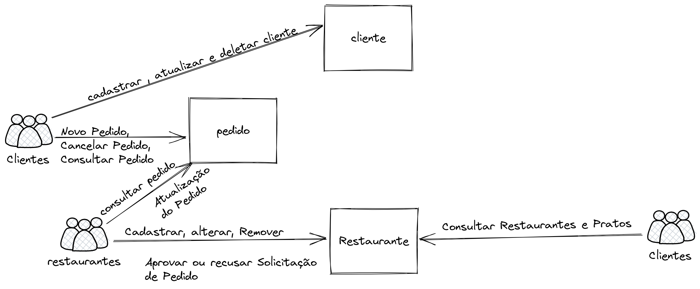

# Delivery de Comidas V1

Neste desafio, vocês criarão um sistema para delivery de comidas de diversos restaurantes.

Com o passar do tempo, o número de serviços e integrações vai aumentando. Conforme a arquitetura mostrada na imagem abaixo

## Serviços

### Clientes
[O serviço de clientes](./cliente.md) é responsável por armazenar todos os dados relativos as pessoas que querem pedir pratos no nosso sistema.

Todo o código desse serviço será armazenado em um [repositório no Github](https://github.com/zup-academy/dojo-bootcamp-java-clientes)

### Restaurantes
[O serviço de restaurante](./restaurante.md) é responsável por armazenar todos os dados relativos aos restaurantes e aos pratos que cada um serve. 

Todo o código desse serviço será armazenado em um [repositório no Github](https://github.com/zup-academy/dojo-bootcamp-java-restaurantes)

### Pedidos
[O serviço de pedidos](./pedido.md) é o principal serviço do sistema. Com ele, as pessoas conseguem fazer seus pedidos e os restaurantes conseguem vender.

Todo o código desse serviço será armazenado em um [repositório no Github](https://github.com/zup-academy/dojo-bootcamp-java-pedidos)

## Formato

Vocês formarão times. Não se preocupem, no dia informamos a quantidade e a composição de cada time. 
O dojo tem o formato Piloto/Copolito. Ou seja, uma pessoa escreve o código enquanto a outra orienta. Depois de um tempo é feita a troca e a pessoa que pilotava se torna copilota e vice-versa

### Dicas na hora do pair-programming

No blog do Martin Fowler existe um [artigo muito bom sobre técnicas de fazer pareamentos](https://martinfowler.com/articles/on-pair-programming.html). Fica como sugestão de leitura caso queiram se aprofundar mais no tema. Para sintetizar, vamos listar algumas coisas que julgamos importante:

- Seja cordial com a pessoa que está pareando;
- Evite distrações, como email e celular;
- Seja paciente
- Aceite ajuda